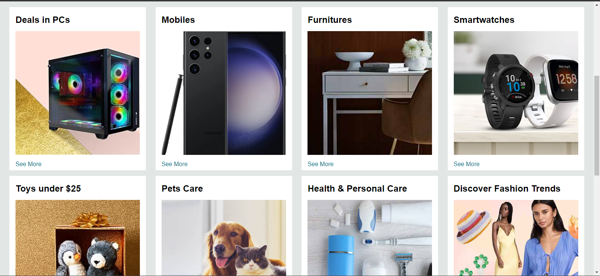
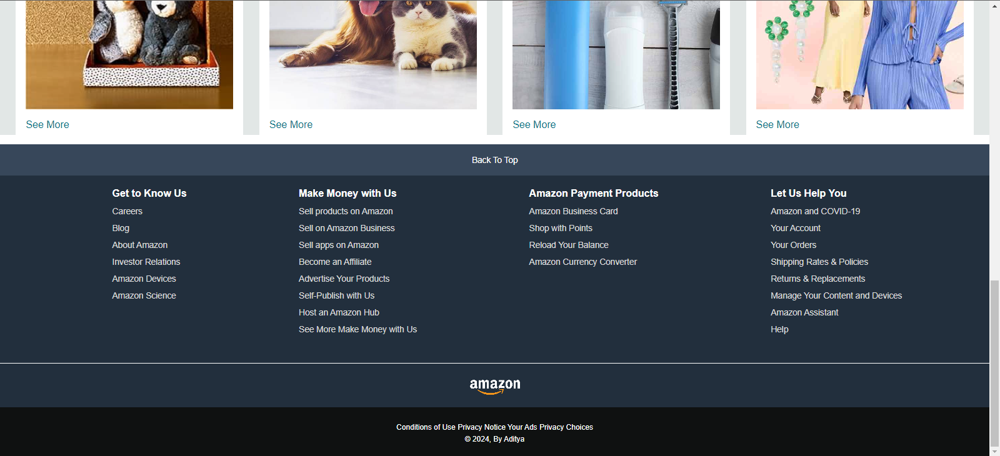

# Amazon Home Page Clone

This project is a clone of the Amazon home page created using HTML and CSS. It serves as a practice project to enhance front-end development skills and showcase the ability to recreate a popular website's user interface.

## Demo






## Features

- Responsive design for various screen sizes.
- Accurate reproduction of Amazon's home page layout.
- Utilizes HTML for structure and CSS for styling.

## Technologies Used

- HTML
- CSS

## Getting Started

To get a copy of this project up and running on your local machine, follow these simple steps:

1. Clone the repository:

```bash
git clone https://github.com/AdityaSanap1821/Amazon-Clone.git
